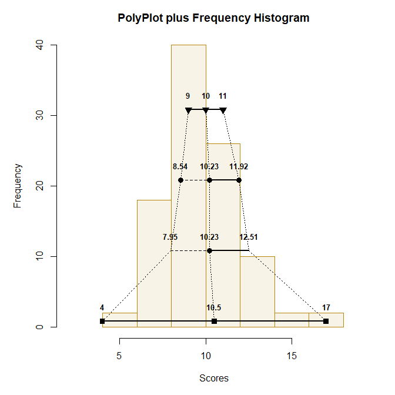

# `polyPlot` 

## A Tool for Visualizing Distributional Statistics

[](https://cran.r-project.org/)
[](https://opensource.org/licenses/MIT)

### Overview

**polyPlot** is a small R package that offers a modified version of Seier and Bonett's (2011) polyplot, a visualization tool for various distributional summary statistics.

<a href="https://github.com/cwendorf/polyPlot">
<p align="center"><kbd></kbd></p>
</a>

### Installation

This package is not currently on CRAN, but can be installed and loaded using these R commands:

``` r
if (!require(remotes)) install.packages("remotes")
remotes::install_github("cwendorf/polyPlot")
library(polyPlot)
```

If you do not wish a full install, the latest functions can be made available using these R commands:

```r
source("http://raw.githubusercontent.com/cwendorf/polyPlot/main/source-polyPlot.R")
```

### Usage

This package contains a set of tutorials to demonstrate its use:

- [polyPlot Overview](./docs/polyPlotOverview.md) - An explanation of the basic and advnaced polyPlot functions
- [Exploring Distributional Shapes](./docs/ExploringDistributionalShapes.md) - Examples of using polyPlot to explore nonnormal data

### Contact Me

- GitHub Issues: [https://github.com/cwendorf/polyPlot/issues](https://github.com/cwendorf/polyPlot/issues) 
- Author Email: [cwendorf@uwsp.edu](mailto:cwendorf@uwsp.edu)
- Author Homepage: [https://github.com/cwendorf](https://github.com/cwendorf)

### Citation

Wendorf, C.A. (2022). *polyPlot: A tool for visualizing distributional statistics* [R Package]. [https://github.com/cwendorf/polyPlot](https://github.com/cwendorf/polyPlot)
