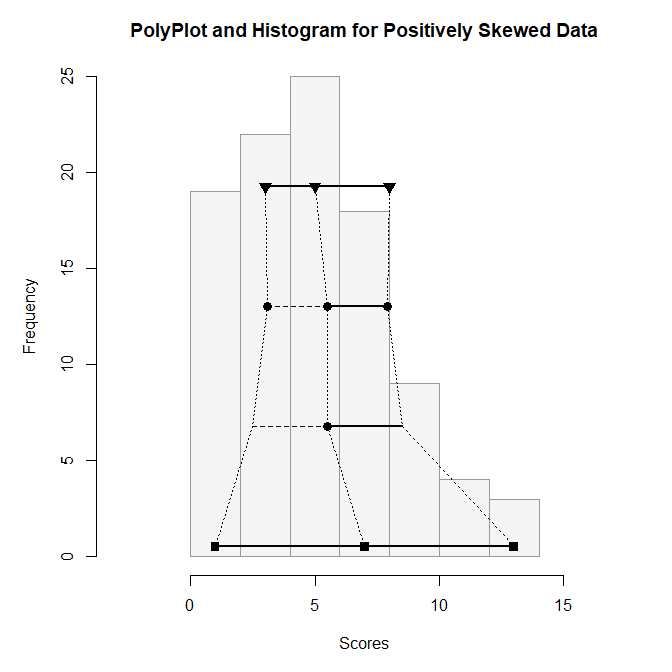
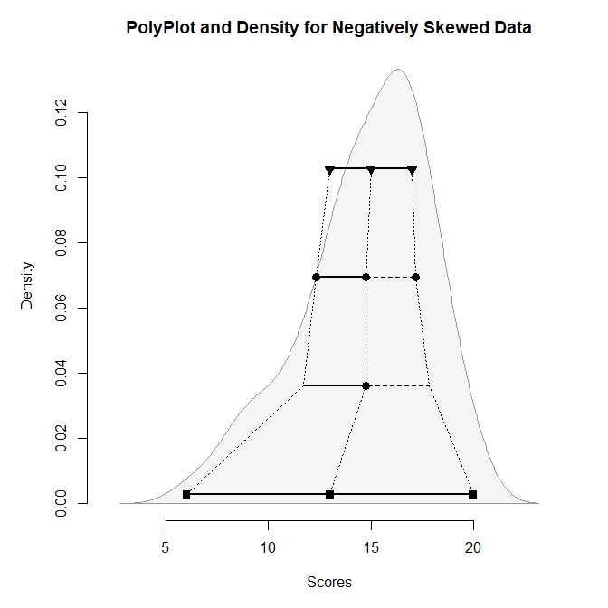
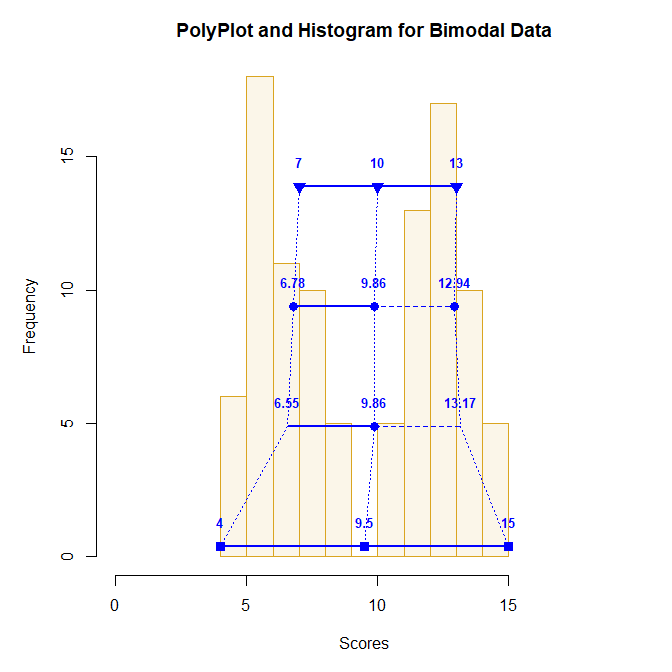
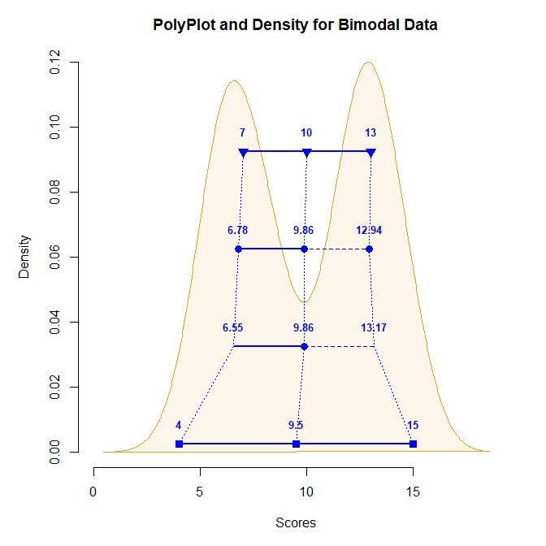

## Exploring Distributional Shapes

The examples below demonstrate how the PolyPlot does a good job of
approximating the shape of the underlying distribution, even in cases of
skewed data.

- [Positively Skewed Data](#positively-skewed-data)
- [Negatively Skewed Data](#negatively-skewed-data)
- [Bimodal Data](#bimodal-data)

------------------------------------------------------------------------

### Positively Skewed Data

For example, simulate some positively skewed data. Use `polyPlot` to get
the statistics plot and a frequency histogram. The calculated values are
not presented on the plot, but are given in a separate table.

``` r
Scores <- round(rbeta(100, 2, 5) * 20, 0)
polyStats(Scores, digits = 3)
```

              Lower Middle  Upper Spread
    Quartiles 3.000    5.0  8.000  2.500
    Means     3.080    5.5  7.920  2.420
    Z Scores  2.497    5.5  8.503  3.003
    Range     1.000    7.0 13.000  6.000

``` r
polyPlot(Scores, values = FALSE, type = "frequency", main = "PolyPlot and Histogram for Positively Skewed Data")
```

<!-- -->

### Negatively Skewed Data

As another example, simulate some negatively skewed data. Use `polyPlot`
to get the statistics plot and a density curve. The calculated values
are not presented on the plot, but are given in a separate table.

``` r
Scores <- round(rbeta(100, 5, 2) * 20, 0)
polyStats(Scores, digits = 3)
```

               Lower Middle  Upper Spread
    Quartiles 13.000  15.00 17.000  2.000
    Means     12.340  14.77 17.200  2.430
    Z Scores  11.689  14.77 17.851  3.081
    Range      6.000  13.00 20.000  7.000

``` r
polyPlot(Scores, values = FALSE, type = "density", main = "PolyPlot and Density for Negatively Skewed Data")
```

<!-- -->

### Bimodal Data

As a final example, simulate some bimodal data. Here the values are
presented on each `polyPlot` to show their utility in explaining the
underlying data.

``` r
Scores <- c(round(rnorm(50, 7, 1), 0), round(rnorm(50, 13, 1), 0))
polyPlot(Scores, type = "frequency", col = "blue", bg = "goldenrod", values = TRUE, main = "PolyPlot and Histogram for Bimodal Data")
```

<!-- -->

``` r
polyPlot(Scores, type = "density", col = "blue", bg = "goldenrod", values = TRUE, main = "PolyPlot and Density for Bimodal Data")
```

<!-- -->
