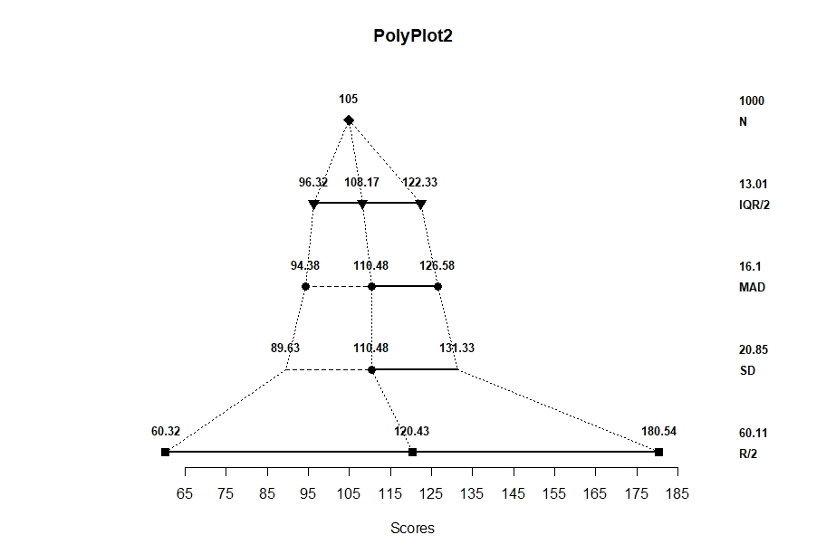

## Tutorial for PolyPlot2

### The Basic PolyPlot

In order to demonstrate the finer points of a polyplot, we first need to create some data. The following code simulates 1000 scores from a positively skewed unimodal distribution.Then we can call `polyplot2` for this set of Scores using all of the default options.

```r
Scores <- c(rnorm(n=600,mean=100,sd=15),rnorm(n=200,mean=115,sd=20),rnorm(n=200,mean=130,sd=25))
polyplot2(Scores)
```

<!-- -->

By default, the function labels all of the points and provides summary statistics in the margin. Generally speaking, each level/row provides a different category of measures of location and spread.

Row | Labeled Points | Margin Value
:-- | :-- | :--
First/Top | The mode of the distribution | The sample size
Second | The quartiles (and median) of the distribution | The interquartile range divided by 2
Third | The means of the halves (and the whole) of the distribution | The mean absolute deviation from the median
Fourth | The mean of the distribution with +/- one standard deviation | The standard deviation
Fifth/Bottom | The range (and midrange) of the distribution | The range divided by 2

### Options for PolyPlot2

If desired, `polyplot2` can be customized in a variety of ways.

```r
polypot2(y,histogram=FALSE,curve=FALSE,main="PolyPlot2",xlab=NULL,xlim=NULL,ylim=NULL,values=TRUE,col="black",bg="gray60",cex=1.2,digits=2) {
```

Argument | Description
:-- | :--
```y``` | a (non-empty) numeric vector of data values
```histogram``` | whether a histogram should be underlayed behind the polyplot
```curve``` | whether a density curve should be underlayed behind the polyplot
```main``` | a custom title for the polyplot
```xlab``` | a custom label for the x axis
```xlim``` | custom limits for the x axis
```ylim``` | custom limits for the y axis
```values``` | whether the points and statistics should labeled and printed
```col``` | custom color for the polyplot points, segments, and labels
```bg``` | custom color for the underlying histogram and/or curve
```cex``` | custom size for the polyplot symbols
```digits``` | number of decimal places for the labels and statistics

### Using the PolyPlot to Determine Shape

The following code demonstrates some of the available options. Similarly, it demonstrates how the PolyPlot does a good job of approximating the shape of the underlying distribution.

```r
par(mfrow=c(1,2))
polyplot2(Scores,histogram=TRUE,curve=FALSE,values=FALSE,main="PolyPlot2 plus Histogram",col="darkblue",bg="darkgoldenrod")
polyplot2(Scores,histogram=FALSE,curve=TRUE,values=FALSE,main="PolyPlot2 plus Density Curve",col="darkblue",bg="darkgoldenrod")
```

<!-- -->

Further explanation of the polyplot and how it can be used to explore the shape of the distribution is available in Seier and Bonett (2011).
