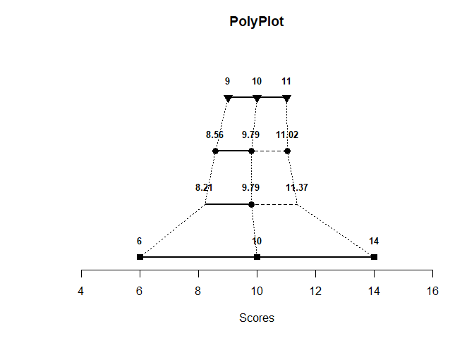
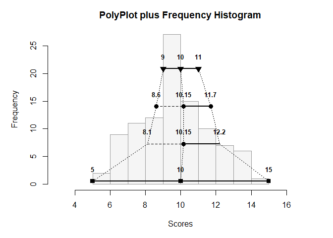
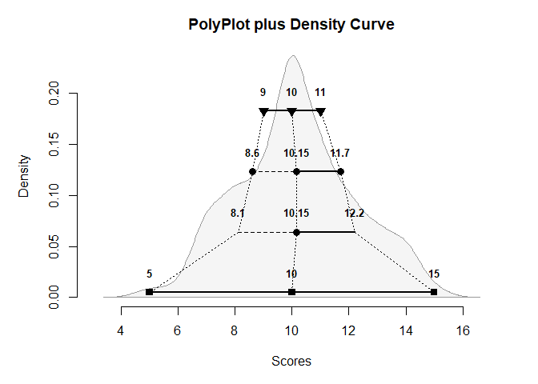

## Basic Tutorial for PolyPlot2

The following codes demonstrates the default options of PolyPlot. It also explains the basic statistics used.

### The PolyPlot

First, simulate a set of 100 scores from a normal distribution. Then call `polyPlot` to get the plot.

```r
Scores <- round(rnorm(100,10,2),0)
polyPlot(Scores)
```

<!-- -->

Generally speaking, each level/row provides a different category of measures of location and spread:

- First/Top: Provides the quartiles (and median as the center) of the distribution, with the interquartile range divided by 2 as the measure of spread
- Second: Provides the means of the halves (and the whole set as the center) of the distribution, with the mean absolute deviation from the median as the measure of spread
- Third: Provides the mean (as the center) of the distribution and points +/- one standard deviation from the mean (i.e, z scores of -1 and 1), with the standard deviation as the measure of spread
- Fourth/Bottom: Provides the range (and midrange as the center) of the distribution, with the range divided by 2 as the measure of spread

### Adding Background Plots

To see the relationship between the PolyPlot and the underlying distribution, either a frequency distribution (histogram) or a density curve can be added in the background.

```r
polyPlot(Scores,type="frequency")
```

<!-- -->

```r
polyPlot(Scores,type="density")
```

<!-- -->

Further explanation of the math behind the PolyPlot is available in Seier and Bonett (2011).
