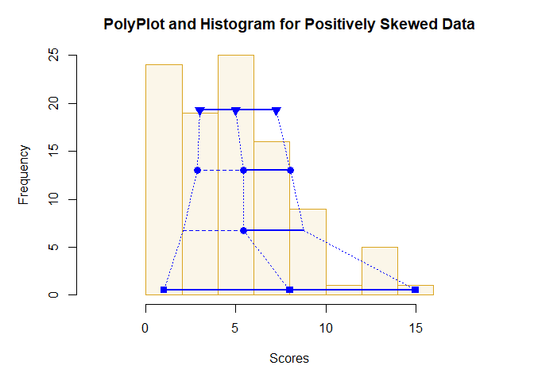
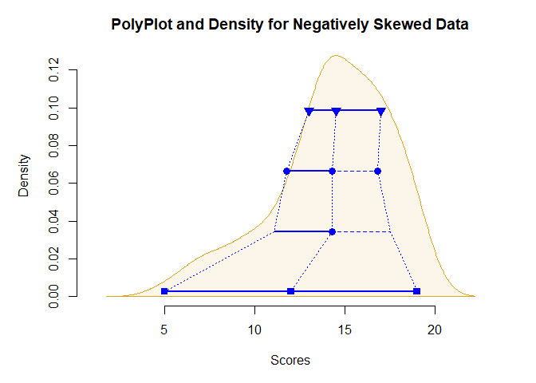
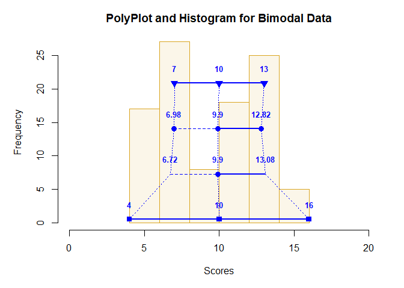
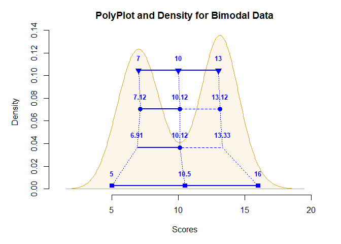

## Advanced Tutorial for polyPlot2

The following code demonstrates some of the available options for
customizing the PolyPlot. It also demonstrates how the PolyPlot does a
good job of approximating the shape of the underlying distribution.

- [The PolyPlot for Positively Skewed
  Data](#the-polyplot-for-positively-skewed-data)
- [The PolyPlot for Negatively Skewed
  Data](#the-polyplot-for-negatively-skewed-data)
- [The PolyPlot for Bimodal Data](#the-polyplot-for-bimodal-data)

------------------------------------------------------------------------

### The PolyPlot for Positively Skewed Data

Simulate some positively skewed data. Then use `polyStats` get the
values separate from the `polyPlot` (which in this case features a
frequency histogram).

``` r
Scores <- round(rbeta(100,2,5)*20,0)
polyStats(Scores,digits=3)
```

    ##           Lower Middle  Upper Spread
    ## Quartiles 4.000   6.00  7.000  1.500
    ## Means     3.520   5.67  7.820  2.150
    ## Z Scores  2.921   5.67  8.419  2.749
    ## Range     1.000   8.00 15.000  7.000

``` r
polyPlot(Scores,type="frequency",col="blue",bg="goldenrod",values=FALSE,main="PolyPlot and Histogram for Positively Skewed Data")
```

<!-- -->

### The PolyPlot for Negatively Skewed Data

Simulate some negatively skewed data. Then use `polyStats` get the
values separate from the `polyPlot` (which in this case features a
density curve).

``` r
Scores <- round(rbeta(100,5,2)*20,0)
polyStats(Scores,digits=3)
```

    ##            Lower Middle  Upper Spread
    ## Quartiles 13.000  14.50 17.000  2.000
    ## Means     11.760  14.28 16.800  2.520
    ## Z Scores  11.042  14.28 17.518  3.238
    ## Range      5.000  12.00 19.000  7.000

``` r
polyPlot(Scores,type="density",col="blue",bg="goldenrod",values=FALSE,main="PolyPlot and Density for Negatively Skewed Data")
```

<!-- -->

### The PolyPlot for Bimodal Data

Simulate some bimodal data. The values are presented on each `polyPlot`
to show their utility in explaining the underlying data.

``` r
Scores <- c(round(rnorm(50,7,1),0),round(rnorm(50,13,1),0))
polyPlot(Scores,type="frequency",col="blue",bg="goldenrod",values=TRUE,main="PolyPlot and Histogram for Bimodal Data")
```

<!-- -->

``` r
polyPlot(Scores,type="density",col="blue",bg="goldenrod",values=TRUE,main="PolyPlot and Density for Bimodal Data")
```

<!-- -->
