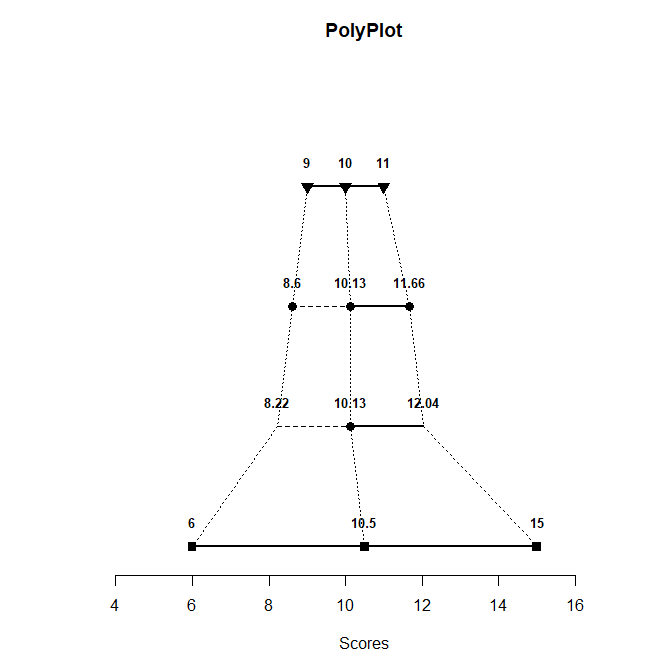
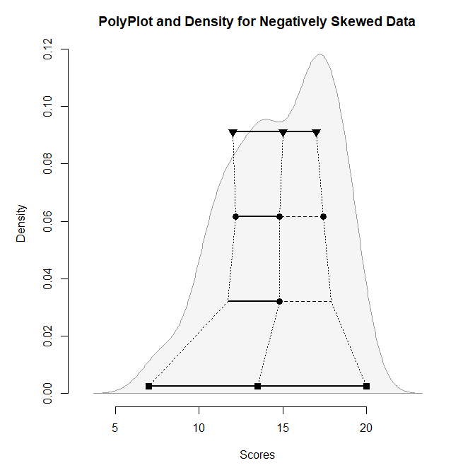
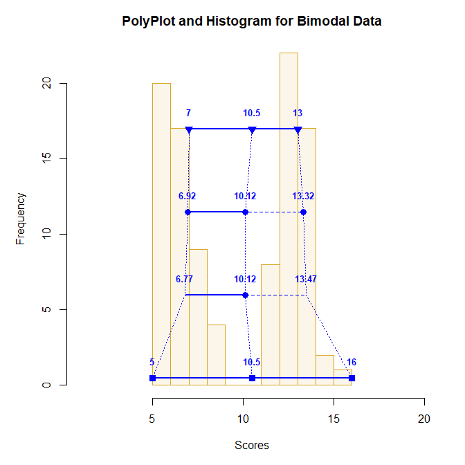
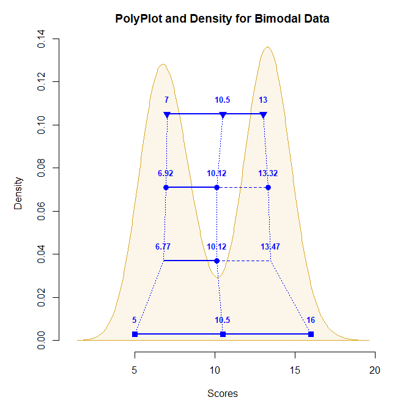

## Tutorial for polyPlot

The following code demonstrates the various options of PolyPlot. It also
explains the basic statistics used. Finally, it demonstrates how the
PolyPlot does a good job of approximating the shape of the underlying
distribution.

- [The Basic PolyPlot](#the-basic-polyplot)
- [Exploring Distributional Shapes](#exploring-distributional-shapes)

------------------------------------------------------------------------

### The Basic PolyPlot

First, simulate a set of 100 scores from a normal distribution. Then
call `polyStats` to get the summary statistics and `polyPlot` to get the
associated plot.

``` r
Scores <- round(rnorm(100, 10, 2), 0)
polyStats(Scores, digits = 3)
```

              Lower Middle  Upper Spread
    Quartiles 9.000  10.00 11.000  1.000
    Means     8.600  10.13 11.660  1.530
    Z Scores  8.225  10.13 12.035  1.905
    Range     6.000  10.50 15.000  4.500

``` r
polyPlot(Scores)
```

<!-- -->

Generally speaking, each level/row provides a different category of
measures of location and spread:

- First/Top: Provides the quartiles (and median as the center) of the
  distribution, with the interquartile range divided by 2 as the measure
  of spread
- Second: Provides the means of the halves (and the whole set as the
  center) of the distribution, with the mean absolute deviation from the
  median as the measure of spread
- Third: Provides the mean (as the center) of the distribution and
  points +/- one standard deviation from the mean (i.e, z scores of -1
  and 1), with the standard deviation as the measure of spread
- Fourth/Bottom: Provides the range (and midrange as the center) of the
  distribution, with the range divided by 2 as the measure of spread

Further explanation of the math behind the PolyPlot is available in
Seier and Bonett (2011).

### Exploring Distributional Shapes

To see the relationship between the PolyPlot and the underlying
distribution, either a frequency distribution (histogram) or a density
curve can be added in the background. If the desire is to focus on
shape, the value labels can be supressed. Colors and titles can be
altered to further enhance the plot.

For example, simulate some positively skewed data. Use `polyPlot` to get
the statistics plot and a frequency histogram.

``` r
Scores <- round(rbeta(100, 2, 5) * 20, 0)
polyPlot(Scores, values = FALSE, type = "frequency", main = "PolyPlot and Histogram for Positively Skewed Data")
```

<!-- -->

As another example, simulate some negatively skewed data. Use `polyPlot`
to get the statistics plot and a density curve.

``` r
Scores <- round(rbeta(100, 5, 2) * 20, 0)
polyPlot(Scores, values = FALSE, type = "density", main = "PolyPlot and Density for Negatively Skewed Data")
```

<!-- -->

As a final example, simulate some bimodal data. Here the values are
presented on each `polyPlot` to show their utility in explaining the
underlying data.

``` r
Scores <- c(round(rnorm(50, 7, 1), 0), round(rnorm(50, 13, 1), 0))
polyPlot(Scores, type = "frequency", col = "blue", bg = "goldenrod", values = TRUE, main = "PolyPlot and Histogram for Bimodal Data")
```

<!-- -->

``` r
polyPlot(Scores, type = "density", col = "blue", bg = "goldenrod", values = TRUE, main = "PolyPlot and Density for Bimodal Data")
```

<!-- -->
