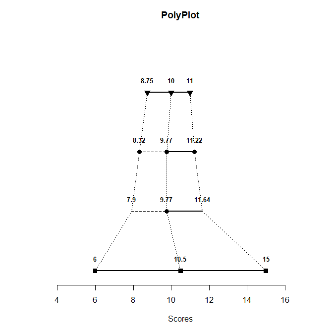
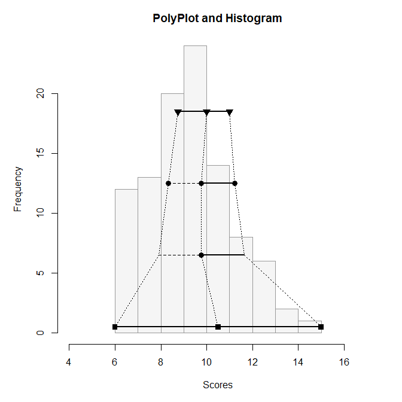
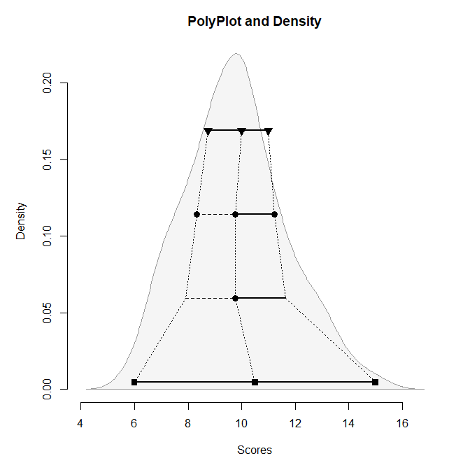
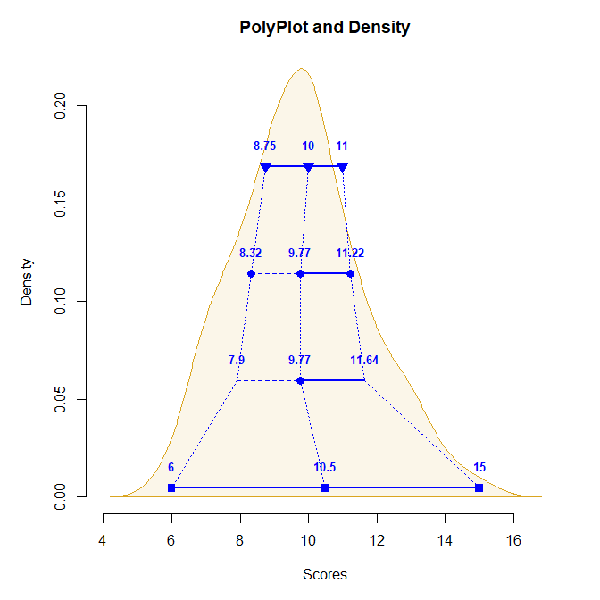

## polyPlot Overview

The following code demonstrates the standard polyPlot and the various
available options.

- [The Basic PolyPlot](#the-basic-polyplot)
- [Adding Features to the Plot](#adding-features-to-the-plot)

------------------------------------------------------------------------

### The Basic PolyPlot

First, simulate a set of 100 scores from a normal distribution. Then
call `polyStats` to get the summary statistics and `polyPlot` to get the
associated plot.

``` r
Scores <- round(rnorm(100, 10, 2), 0)
polyStats(Scores, digits = 3)
```

              Lower Middle  Upper Spread
    Quartiles 8.750  10.00 11.000  1.125
    Means     8.320   9.77 11.220  1.450
    Z Scores  7.901   9.77 11.639  1.869
    Range     6.000  10.50 15.000  4.500

``` r
polyPlot(Scores)
```

<!-- -->

Generally speaking, each level/row provides a different category of
measures of location and spread:

- First/Top: Provides the quartiles (and median as the center) of the
  distribution, with the interquartile range divided by 2 as the measure
  of spread
- Second: Provides the means of the halves (and the whole set as the
  center) of the distribution, with the mean absolute deviation from the
  median as the measure of spread
- Third: Provides the mean (as the center) of the distribution and
  points +/- one standard deviation from the mean (i.e, z scores of -1
  and 1), with the standard deviation as the measure of spread
- Fourth/Bottom: Provides the range (and midrange as the center) of the
  distribution, with the range divided by 2 as the measure of spread

Further explanation of the math behind the PolyPlot is available in
Seier and Bonett (2011).

### Adding Features to the Plot

To see the relationship between the PolyPlot and the underlying
distribution, either a frequency distribution (histogram) or a density
curve can be added in the background. If the desire is to focus on
shape, the value labels can be suppressed. Colors and titles can be
altered to further enhance the plot.

Use `polyPlot` to get the statistics plot and a frequency histogram.

``` r
polyPlot(Scores, values = FALSE, type = "frequency", main = "PolyPlot and Histogram")
```

<!-- -->

Instead, use `polyPlot` to get the statistics plot and a density curve.

``` r
polyPlot(Scores, values = FALSE, type = "density", main = "PolyPlot and Density")
```

<!-- -->

Or, modify the `polyPlot` density example to add color and retain the
labeling.

``` r
polyPlot(Scores, type = "density", col = "blue", bg = "goldenrod", values = TRUE, main = "PolyPlot and Density")
```

<!-- -->
